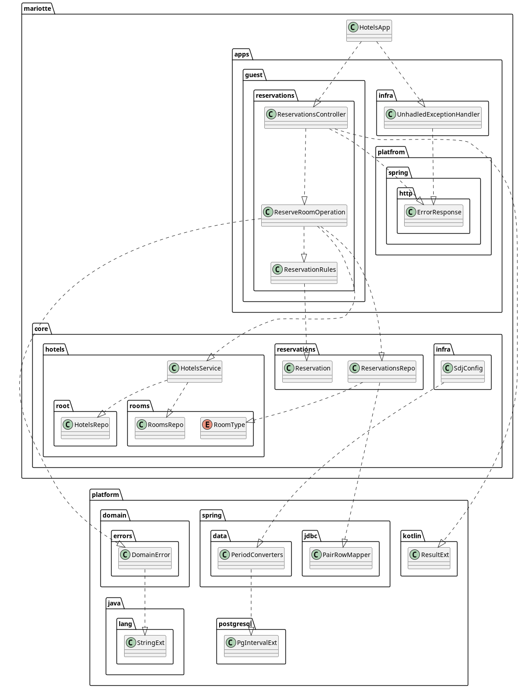

:toc: macro
:toc-levels: 3
:toc-title: Содержение
ifdef::env-github[]
:note-caption: :information_source:
endif::[]

= Project Mariotte

Проект Мариотт - это демо проект https://azhidkov.pro/ergo-approach/landing/[Эргономичного подхода] на примере сервиса бронирования номеров в отелях.

toc::[]

== Карта проекта

В этом разделе собранны "Points of Interest" кодовой базы - ссылки на код, иллустрирующий применение Эргономичного подхода или просто штуки, которые я считаю малоизвестными и полезными.

. Код иллюстрирующий Эргономичный подход
.. Тестирование
... Тесты на поведение
+
https://github.com/ergonomic-code/Project-Mariotte/blob/master/src/test/kotlin/cases/apps/guest/reservation/RoomReservationTest.kt#L43[RoomReservationTest:43]
... Эффективный запуск PostgreSQL для тестов
+
https://github.com/ergonomic-code/Project-Mariotte/blob/master/src/test/kotlin/infra/Postgres.kt[Postgres.kt]
... Доменно-специфичный матчер
+
https://github.com/ergonomic-code/Project-Mariotte/blob/master/src/test/kotlin/assertions/ReservationsMatchers.kt[ReservationMatchers.kt]
... Генерация случайных тестовых данных
+
https://github.com/ergonomic-code/Project-Mariotte/blob/master/src/test/kotlin/fixtures/RandomData.kt[RandomData.kt]
... ObjectMothers
+
https://github.com/ergonomic-code/Project-Mariotte/blob/master/src/test/kotlin/fixtures/HotelsObjectMother.kt[HotelsObjectMother]
+
https://github.com/ergonomic-code/Project-Mariotte/blob/master/src/test/kotlin/fixtures/ReservationsObjectMother.kt[ReservationsObjectMother]
+
https://github.com/ergonomic-code/Project-Mariotte/blob/master/src/test/kotlin/fixtures/RoomsObjectMother.kt[RoomsObjectMother]
... Клиенты приложений и API фич
+
https://github.com/ergonomic-code/Project-Mariotte/blob/master/src/test/kotlin/clients/Guest.kt[Guest]
+
https://github.com/ergonomic-code/Project-Mariotte/blob/master/src/test/kotlin/clients/apis/ReservationsApi.kt[ReservationsApi]
.. Неизменяемая модель данных
+
https://github.com/ergonomic-code/Project-Mariotte/blob/master/src/main/kotlin/mariotte/core/hotels/rooms/Room.kt[Room]
+
https://github.com/ergonomic-code/Project-Mariotte/blob/master/src/main/kotlin/mariotte/core/hotels/root/Hotel.kt[Hotel]
+
https://github.com/ergonomic-code/Project-Mariotte/blob/master/src/main/kotlin/mariotte/core/reservations/Reservation.kt[Reservation]
.. Модель на базе диаграммы эффектов
... Простая операция
+
https://github.com/ergonomic-code/Project-Mariotte/blob/master/src/main/kotlin/mariotte/apps/guest/reservations/ReservationsController.kt#L74[ReservationsController:74]
... Сложная операция (аля ROP на guard clause-ах, структурный дизайн)
+
https://github.com/ergonomic-code/Project-Mariotte/blob/master/src/main/kotlin/mariotte/apps/guest/reservations/ReserveRoomOperation.kt[ReserveRoomOperation]
... Простой ресурс
+
https://github.com/ergonomic-code/Project-Mariotte/blob/master/src/main/kotlin/mariotte/core/reservations/ReservationsRepo.kt[ReservationsRepo]
... Сложный ресурс
+
https://github.com/ergonomic-code/Project-Mariotte/blob/master/src/main/kotlin/mariotte/core/hotels/HotelsService.kt[HotelsService]
+
https://github.com/ergonomic-code/Project-Mariotte/blob/master/src/main/kotlin/mariotte/core/hotels/root/HotelsRepo.kt[HotelsRepo]
+
https://github.com/ergonomic-code/Project-Mariotte/blob/master/src/main/kotlin/mariotte/core/hotels/rooms/RoomsRepo.kt[RoomsRepo]
.. Кодирование
... Обход проблемы интеграции Spring Transactions с Kotlin Result
+
В идеальном мире, операции должны явно возвращать результат в случае ошибок.
Однако Spring-овые транзакции поддерживают Кotlin `Result` из стандартной библиотеки (а тащить ради этого Java-вый https://github.com/vavr-io/vavr[vavr] кажется оверкиллом).
+
Для того чтобы обойти эту проблему я сейчас использую схему, когда операции выбрасывают ошибки исключениями (чтобы откатить транзакци), а клиенты операций обарачивают их в `Result` с помощью `runCatching`.
+
https://github.com/ergonomic-code/Project-Mariotte/blob/master/src/main/kotlin/mariotte/apps/guest/reservations/ReserveRoomOperation.kt#L106[ReserveRoomOperation:106]
+
https://github.com/ergonomic-code/Project-Mariotte/blob/master/src/main/kotlin/mariotte/apps/guest/reservations/ReserveRoomOperation.kt#L112[ReserveRoomOperation:112]
+
https://github.com/ergonomic-code/Project-Mariotte/blob/master/src/main/kotlin/mariotte/apps/guest/reservations/ReserveRoomOperation.kt#L118[ReserveRoomOperation:118]
+
https://github.com/ergonomic-code/Project-Mariotte/blob/master/src/main/kotlin/mariotte/apps/guest/reservations/ReserveRoomOperation.kt#L131[ReserveRoomOperation:131]
+
https://github.com/ergonomic-code/Project-Mariotte/blob/master/src/main/kotlin/mariotte/apps/guest/reservations/ReservationsController.kt#L62[ReservationsController:62]
+
https://github.com/ergonomic-code/Project-Mariotte/blob/master/src/main/kotlin/mariotte/apps/guest/reservations/ReservationsController.kt#L75[ReservationsController:75]
... "Очевидизация" вариантов ответов эндпоинта
+
Я придерживаюсь мнения, что явное перечисление всех возможных исходов выполнения операции способствует пониманию кода и снижает вероятность внесения регрессий при его модификации.
Для этого я, с одной стороны, оборачиваю исключения в Result, а с другой стороны явно разбираю его на ожидаемые варианты в одном `when`-выражении.
+
https://github.com/ergonomic-code/Project-Mariotte/blob/master/src/main/kotlin/mariotte/apps/guest/reservations/ReservationsController.kt#L64[ReservationsController:64]
+
https://github.com/ergonomic-code/Project-Mariotte/blob/master/src/main/kotlin/mariotte/apps/guest/reservations/ReservationsController.kt#L77[ReservationsController:77]
. Прочие "Points of interest"
.. Верификация Json-схем
+
Для того, чтобы переиспользовать продовые модели запросов и ответов и при этом обезопасится от поломки обратной совместимости API я использую Json-схемы.
+
Для этого API фич в сигнатурах методов используют те же модели, что и продовые контроллеры, но внутри самостоятельно (де)сериализуют их в JSON-строки и верифицируют их на соответствие схемам.
+

.. Problem Details
... ErrorResponse
... UnhandledExceptionsHandler
.. PostgreSQL generate_series
.. Пессимистичные блокировки в Spring Data JDBC
.. Kotlin value-класс
.. RepeatedTest

== "Техническое задание"

* Сервис должен обеспечивать бронирования номеров в разных отелях;
* Сервис должен поддерживать типы номерков, определённых международным стандартом ISO 404:404 - люкс и полу люкс;
* Бронирование определяет только тип номера, но не конкретный номер.
Конкретный номер выбирает администратор при заселении гостя;
* Сервис должен исключать овербукинг - создание большего количества броней номеров определённого типа в одном отеле за определённую дату, чем есть в целом номеров данного типа в отеле;
* Сервис должен не допускать бронирования, начинающиеся ранее следующих суток относительно момента времени запроса на бронирование.

== Системная аналитика

=== Модель предметной области

image::docs/images/ER.drawio.svg[]

[NOTE]
====
Модель предметной области представлена https://azhidkov.pro/microposts/23/11/immutable-relation-data-model-v2/[Эргономичной нотации ER-модели]
====

=== Спецификация HTTP API

[NOTE]
====
Этот раздела написан в моём самодельном легковесном и слабо формализованном формате описания HTTP-эндпоинтов.

Маппинг ошибок на коды статусов выполнен в соответствии с https://github.com/ergonomic-code/Ergo-Approach-Guideline/wiki/Проектирование-HTTP-API#коды-ошибок[гайдлайном эргономичного подхода].
====

==== Модель RoomReservationRequest

[source]
----
{
  "hotelId": <number>
  "roomType": <number>
  "email": <string:email>
  "from": <string:iso-8601 date>
  "period": <string:iso-8601 duration>
}
----

==== Модель ReservationSuccess

[source]
----
{
  "reservationId": <number>
}
----

==== Модель ReservationDetails

[source]
----
{
  "hotel": <number>
  "roomType": <number>
  "email": <string:email>
  "from": <string:iso-8601 date>
  "period": <string:iso-8601 duration>
}
----

==== Модель ErrorResponse

Соответствует спецификации https://datatracker.ietf.org/doc/html/rfc7807[Problem Details for HTTP APIs], всегда содержит дополнительное свойство timestamp.

[source]
----
{
  "timestamp": <string:iso-8601 timestmap>,
  "instance": <string:uri-reference>,
  "status": <number:200..600>,
  "type": <string:uri-reference>
  "title": <string>
  "details": <string>
}
----

==== Метод reserveRoom

Метод бронирования комнаты в отеле на период.

Предусловия:

* Передан идентификатор отеля, существующий в БД;
* Передан корректный тип номера;
* В заданном отеле есть номера заданного типа;
* Переданная дата "от" находится в будущем, не менее чем на один день от момента поступления запроса;
* Длительность периода составляет один или более дней;
* В запрошенном отеле за каждый запрошенный день есть свободный номер запрошенного типа.

Постусловия:

* В БД в коллекцию бронирований добавлен добавлена бронь, соответсвующая запросу;
* Количество доступных номеров указанного типа за указанный период уменьшено на 1.

[source]
----
POST /guest/reservations
>
  <RoomReservationRequest>

<
  201
    <ReservationSuccess>

  400
    <ErrorResponse> // некорректный зарос

  409
    <ErrorResponse:reservation-dates-in-past> // до даты начала резервации осталось менее дня

  409
    <ErrorResponse:hotel-not-found> // отель с указанным идентификатором не найден

  409
    <ErrorResponse:room-type-not-found> // номер указанного типа в отеле с указанным идентификатором не найден

  409
    <ErrorResponse:no-available-rooms> // за запрошенные даты в отеле нет свободных комнат запрошенного типа

  500
    <ErrorResponse> // при обработке запроса произошла ошибка неожиданная ошибка
----

==== Метод getReservationDetails

Метод просмотра информации о бронировании

Предусловия:

* Передан идентификатор существующей брони;

Постусловия:

* Возвращена информация о бронировании, соответсвующая переданному идентификатору

[source]
----
GET /guest/reservations/{reservationId}
>

<
  201
    <ReservationDetails>

  400
    <ErrorResponse> // некорректный зарос

  500
    <ErrorResponse> // при обработке запроса произошла ошибка неожиданная ошибка
----

=== Диаграмма эффектов

image::docs/images/arch.drawio.svg[]

Здесь используется обновлённая и пока неописанная нотация https://azhidkov.pro/effects-diagram/landing/[Диаграммы эффектов] - зелёные шестиугольники это события, фиолетовые прямоугольники и круги - операции, оранжевые (коричневые?) прямоугольники - ресурсы, ресурсы в ресурсах - агрегированные ресурсы.

=== Структурная схема (Граф вызовов)

image::docs/images/Call-graph.drawio.svg[]

Здесь красными блоками отмечены функции с эффектами (функции, выполняющие ввод-вывод - императивная оболочка), а синими - чистые функции трансформаций (функциональное ядро).

=== Структура пакетов

.Пакеты приложения со стержневыми классами и зависимостями между ними

.Описание пакетов приложения
|===
|Пакет |Описание

|mariotte
|Код, специфичный для данного приложения.

|mariotte.apps
|Код приложений проекта.

Я придерживаюсь модели, когда у одного проекта может быть несколько приложений исходя из ролей пользователей и UX.

Как правило, у проекта есть приложения анонима для входа в систему, приложения основного пользователя для работы с системой, приложение администратора для настройки системы, приложение DevOps-инженера/инфраструктуры для эксплуатации
и технического обслуживания системы.

В этом проекте есть только приложение гостя - основного пользователя системы.

|mariotte.apps.guest
|Код обеспечивающий работу приложения гостя.

|mariotte.apps.guest.reservations
|Код обеспечивающий работу юз-кейса "Бронирование номера".

Пакеты отдельных приложений можно декомпозировать по экранам пользовательского интерфейса, юз-кейсам и фичам,
в зависимости от ваших предпочтений.

|mariotte.apps.infra
|Пакет инфраструктурных бинов все (web-) приложений.

В любом пакете приложения может быть подпакет infra, который содержит определения инфраструктурных Spring-бинов,
обеспечивающих работу модуля родительского пакета.

В данном случае в этом пакете содержится бин, глобального обработчика ошибок, который рендерит ошибки в
виде ProblemDetails с timestamp-ом.

|mariotte.apps.platform
|Библиотечный код, используемый всеми приложениями.

Эвристика для разделения инфраструктурного кода - количество и срок жизни экземпляров классов.
Если экземпляров создаётся не много и живут они долго - такие штуки идут в infra.
Если это статические (top-level) функции или объекты которые создаются в больших количествах и живут миллисекунды - такой код идёт в platform.

|mariotte.apps.platform.spring
|Библиотечный код, дополняющий проекты Spring.

У меня нет жёсткого гайдлайна по декомпозиции кода платформы, но в целом я стараюсь чтобы структура пакетов напоминала структуру пакетов, дополняемого кода.

|mariotte.apps.platform.spring.http
|Расширения классов в пакете `org.springframework.http`

|mariotte.core
|Ядро (предметная область, сущности, ресурсы) системы.

Части ядра используются разными приложениями.

Например, часть приложения с профилями пользователей может использоваться как приложением основного пользователя для доступа к собственному профилю, так и приложением администратора для доступа к профилю любого пользователя.

`core` содержит ресурсы, управляемые разработчиками проекта, а ресурсы, управляемые третьими лицами, помещаются в пакет `i9ns` (integrations).

|mariotte.core.hotels
a|Пакет составного ресурса логического^*^ агрегата "Отель".

[NOTE]
====
^*^ см. https://azhidkov.pro/microposts/23/11/immutable-relation-data-model-v2/[Нотация описания неизменяемой модели данных].
====

|mariotte.core.hotels.rooms
|Пакет ресурса физического агрегата "Номер".

|mariotte.core.hotels.root
|Пакет ресурса физического агрегата "Отель", который является корнем одноимённого логического агрегата.

|mariotte.core.reservations
|Пакет ресурса агрегата "Бронь".

|mariotte.core.infra
|Пакет с инфраструктурными бинами (конвертерами класса Period в данном случае), обеспечивающими работу модулей ядра.

|platform
|Универсальный код, который можно переиспользовать во множестве приложений.
Как вариант, его можно вынести в отдельную библиотеку, но на мой взгляд это создаст лишнюю сцепленность
между независимыми проектами, поэтому я обычно такой код копирую по мере необходимости.

|platform.domain.errors
|Фреймворк доменных ошибок, используемый всем прикладным кодом.

|platform.kotlin
|Расширения стандартной библиотеки Kotlin.

|platform.java.lang
|Расширения классов из пакета `java.lang`

|platform.postgres
|Расширения классов JDBC-драйвера PostgreSQL.

|platform.spring
|Расширения модулей Spring

|platform.spring.jdbc
|Расширения классов из пакета `org.springframework.jdbc`

|platform.spring.data
|Дополнения функциональности модуля Spring Data Commons

|===

== Требования к окружению

* JDK >=21
* Docker >=26.1.3

== Запуск тестов

[source,shell]
----
./gradlew test
----

== Сборка проекта

[source,shell]
----
./gradlew build
----

== Запуск проекта

[source,shell]
----
java -jar -Dspring.profiles.active=demo build/libs/project-mariotte-0.0.1-SNAPSHOT.jar
----

=== Примеры запросов

.Бронирование номера
[source,shell]
----
curl --url 'http://localhost:8080/guest/reservations' \
     --header 'Content-Type: application/json' \
     --data-raw '{
        "hotelId": 1,
        "roomType": 1,
        "from": "2024-06-14",
        "period": "p1d",
        "email": "test@azhidkov.pro"
     }'

----

.Запрос информации о брони
[source,shell]
----
curl --url 'http://localhost:8080/guest/reservations/1'
----
